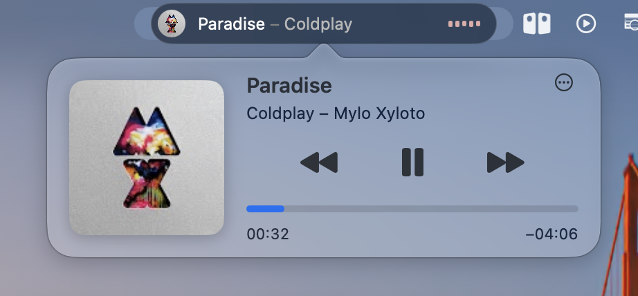

# Now Playing Island

Widżet „teraz odtwarzane” w pasku menu macOS, w stylu Dynamic Island.
Pokazuje aktualny utwór z dowolnego odtwarzacza, także z aplikacji webowych, takich jak YouTube Music zainstalowane z Chrome. Ma okrągłą okładkę i słupki equalizera, które reagują na muzykę.

[English version](README.md)




## Funkcje

- **Dowolny odtwarzacz.** Korzysta z systemowej informacji „Teraz odtwarzane”, więc działa z YouTube Music (także jako aplikacja z przeglądarki), Spotify, Apple Music, kartami przeglądarki i innymi.
- **Equalizer reagujący na muzykę.** Słupki pokazują bas, środek i górę pasma tego, co gra (macOS 14.2+), w kolorze wyciągniętym z okładki.
- **Szklana wyspa.** Matowa pigułka, która dopasowuje się do wysokości paska menu.
- **Panel „Teraz odtwarzane”.** Kliknięcie wyspy pokazuje dużą okładkę, sterowanie i pasek postępu, który można przeciągać. Kliknięcie okładki lub tytułu otwiera odtwarzacz.
- **Lekka.** Jedna natywna aplikacja w Swifcie, bez Electrona i bez dodatkowych usług w tle.
- **Po polsku i po angielsku**, zależnie od języka systemu.

## Wymagania

- macOS 13 Ventura lub nowszy (słupki reagujące na muzykę wymagają macOS 14.2 lub nowszego)
- [Homebrew](https://brew.sh)
- Narzędzia Xcode Command Line Tools (`xcode-select --install`); pełne Xcode nie jest potrzebne

## Instalacja

```bash
git clone https://github.com/YOUR_USERNAME/now-playing-island.git
cd now-playing-island
./install.sh
```

Skrypt w razie potrzeby instaluje [media-control](https://github.com/ungive/media-control), buduje aplikację na twoim Macu, umieszcza ją w `~/Applications` i ustawia uruchamianie przy logowaniu.

Po uruchomieniu **przytrzymaj ⌘ i przeciągnij wyspę** w wybrane miejsce paska.

### Dostęp do dźwięku

Przy pierwszym uruchomieniu macOS zapyta o zgodę na nagrywanie dźwięku systemu. Aplikacja potrzebuje jej tylko do mierzenia głośności basu, środka i góry pasma, żeby słupki ruszały się z muzyką. **Nic nie jest nagrywane, zapisywane ani nigdzie wysyłane.** Podczas grania macOS może pokazywać w pasku wskaźnik nagrywania. Na pauzie aplikacja przestaje słuchać.

Bez zgody wszystko inne działa, a słupki animują się spokojnie same. Funkcję można całkiem wyłączyć ustawieniem `reactToMusic = false` (patrz niżej).

## Ustawienia

Ustawienia są na początku pliku [`Sources/main.swift`](Sources/main.swift). Po zmianie uruchom ponownie `./install.sh`.

| Ustawienie | Domyślnie | Opis |
|---|---|---|
| `islandWidth` | `250` | Szerokość wyspy w punktach |
| `islandHeight` | `0` | `0` dopasowuje do paska; inna wartość to stała wysokość |
| `verticalInset` | `4` | Odstęp nad i pod wyspą (tylko przy automatycznej wysokości) |
| `innerPadding` | `5` | Odstęp zawartości od krawędzi wyspy |
| `glassTint` | `0.25` | Przyciemnienie szkła, od `0` (przezroczyste) do `1` (czarne) |
| `showArtist` | `true` | „Tytuł – Wykonawca” zamiast samego tytułu |
| `showControls` | `false` | Przyciski sterowania na samej wyspie |
| `showBars` | `true` | Słupki equalizera |
| `reactToMusic` | `true` | Słupki reagują na dźwięk |
| `playerAppName` | `"YouTube Music"` | Aplikacja otwierana z panelu |

## Odinstalowanie

```bash
./uninstall.sh
```

Usuwa aplikację i uruchamianie przy logowaniu. media-control zostaje; jeśli go nie potrzebujesz, usuń go przez `brew uninstall media-control`.

## Rozwiązywanie problemów

**Wyspa znika albo pojawia się po lewej stronie.**
Na Macach z notchem ikonki mieszczą się tylko na prawo od niego. Zmniejsz `islandWidth` (np. do `220`) albo schowaj kilka innych ikonek aplikacją do zarządzania paskiem menu.

**Słupki nie reagują na muzykę.**
Sprawdź Ustawienia systemowe → Prywatność i ochrona → Nagrywanie ekranu i dźwięku systemu i zezwól Now Playing Island na dźwięk systemu. Każda reinstalacja to nowa kompilacja, więc macOS może zapytać ponownie. Po udzieleniu zgody zamknij wyspę z jej panelu i otwórz ją jeszcze raz.

**Szkło wygląda źle na drugim monitorze.**
macOS rysuje ikonki na nieaktywnym monitorze jako kopię paska z głównego ekranu, więc rozmycie bierze się z tła głównego ekranu. To ograniczenie systemu.

**Nic się nie pokazuje.**
Podczas grania wpisz w Terminalu `media-control get`. Jeśli nic nie wypisze, macOS nie zgłasza, co gra; szczegóły znajdziesz w projekcie [media-control](https://github.com/ungive/media-control).

## Jak to działa

Aplikacja co sekundę pyta `media-control get` o aktualny utwór, okładkę i pozycję odtwarzania, i przez to samo narzędzie wysyła polecenia sterowania. Na potrzeby equalizera tworzy w Core Audio podsłuch wyjścia systemowego, dzieli sygnał prostymi filtrami na trzy pasma i porównuje każde z jego niedawną średnią. Interfejs to SwiftUI w `NSStatusItem`.

## Podziękowania

- [media-control](https://github.com/ungive/media-control) autorstwa [@ungive](https://github.com/ungive), dzięki któremu odczyt „Teraz odtwarzane” działa na najnowszych wersjach macOS.

## Licencja

[MIT](LICENSE)

Projekt niezwiązany z Apple, Google ani YouTube.
